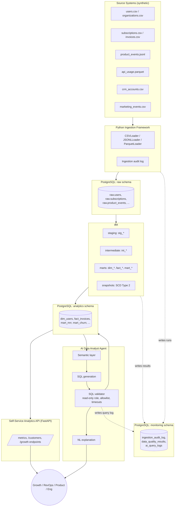

# Architecture

## Overview

The AI-Powered Growth Data Platform is a batch ELT system that centralizes data from a fictional
AI SaaS company's fragmented source systems (application DB, billing, product usage events, CRM,
marketing, API logs) into a single PostgreSQL warehouse, models it with dbt into analytics-ready
marts, and serves it through a self-service REST API and a governed AI query agent.

## Pipeline flow

```
Sources (CSV / JSONL / Parquet)
        |
        v
Python ingestion (loaders + audit log)
        |
        v
PostgreSQL: raw schema
        |
        v
dbt staging layer (cleaning, typing, deduplication)
        |
        v
dbt intermediate layer (reusable business transforms)
        |
        v
dbt marts (dims/facts, growth + revenue marts)
        |
        v
Analytics API (FastAPI, read models only)
        |
        v
AI Data Analyst Agent (semantic layer -> SQL -> validator -> read-only execution -> NL answer)
```

## Diagram



## Schema layout

| Schema | Owner | Purpose |
|---|---|---|
| `raw` | Ingestion | Untransformed landing tables, one per source file. Append-only or upserted by natural/source key. |
| `staging` | dbt | 1:1 cleaned views over `raw`: renamed columns, standardized types, normalized strings, deduplication. No business logic. |
| `intermediate` | dbt | Reusable business transforms joining multiple staging models (e.g. subscription history, customer revenue, conversion funnels). |
| `analytics` | dbt | Business-facing marts: dimensions, facts, and growth/revenue marts. This is the only schema the API and AI agent read from. |
| `monitoring` | Ingestion + dbt + API | Operational metadata: ingestion audit log, data quality results, AI agent query logs. |

## Why schemas instead of separate databases

Keeping every layer in one PostgreSQL database, separated by schema, keeps dbt `ref()`/`source()`
resolution simple, avoids cross-database query limitations, and mirrors how most production dbt
warehouses on a single Postgres/Redshift/Snowflake instance are organized. `generate_schema_name`
(added in Phase 6) controls the exact schema each model lands in.

## Why the AI agent never gets raw database credentials

The agent only ever executes through a dedicated read-only PostgreSQL role, against an allowlist of
`analytics.*` tables, through a SQL validator that rejects anything but a single `SELECT` statement,
enforces a row limit, and applies a query timeout. See `docs/business_metrics.md` (Phase 17) and
`app/agent/sql_validator.py` (Phase 20) for the full design once implemented.

## Local run

```bash
cp .env.example .env
docker compose up -d
curl http://localhost:8000/health
```

`postgres` and `analytics-api` both expose Docker healthchecks; `docker compose up -d` will not
report the stack healthy until Postgres is accepting connections and `/health` returns 200.

## What's implemented so far (Phase 1)

- Repository and Docker skeleton
- PostgreSQL schema bootstrap (`raw`, `staging`, `intermediate`, `analytics`, `monitoring`)
- FastAPI service with a DB-backed `/health` check
- Empty dbt project shell configured for the staging/intermediate/marts schema layout

Everything else in the diagram above (ingestion, dbt models, marts, the API's business endpoints,
and the AI agent) is built out in later phases per the project plan.
